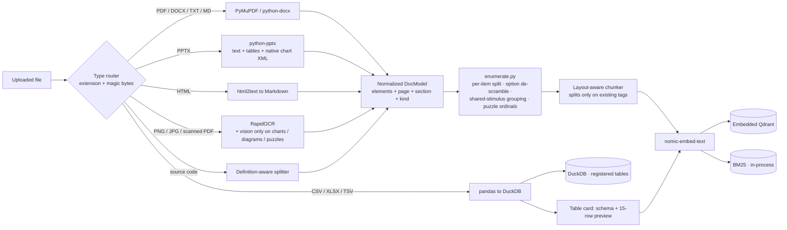
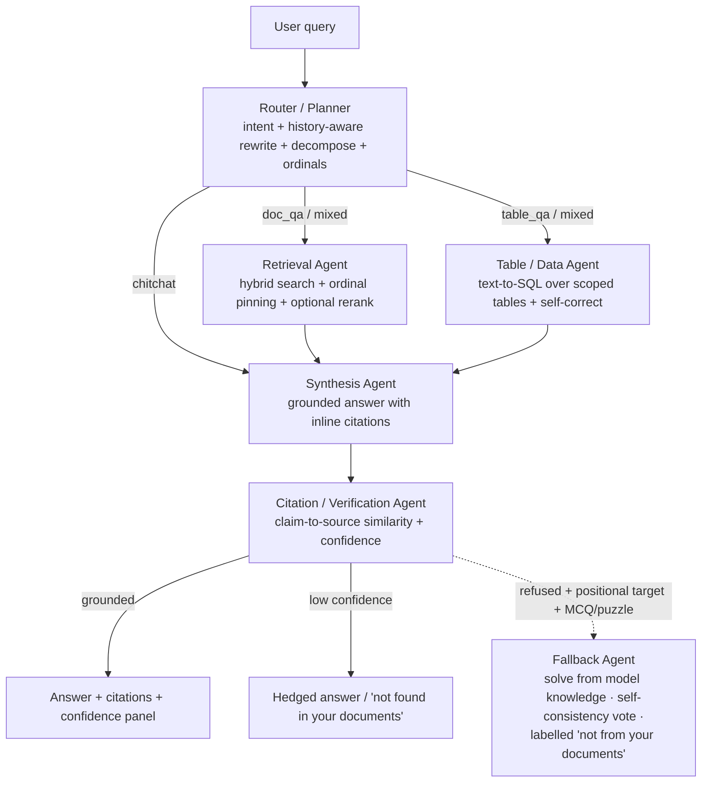

# Grounded

**A multi-agent document chat that cites every claim, scores its own confidence,
and says "I don't know" when the answer isn't in your files.**

Point it at a messy pile of documents (PDFs, Word docs, slide decks,
spreadsheets, HTML pages, scanned images, code) and ask questions across all of
them. Each answer carries inline `[n]` citations that resolve to a file, a page
and the exact snippet. The search index, the embeddings and the spreadsheet
queries all run on your machine.

The original brief was open-source-only. A follow-up allowed paid keys, so the
shipped config points at the **Anthropic API** (`claude-haiku-4-5` for routing
and synthesis, `claude-sonnet-5` for the fallback), which is what the harder
documents were validated on. Set `LLM_PROVIDER=ollama` and the same pipeline runs
fully local on `qwen2.5:7b` with no Docker and no GPU. Nothing above `llm.py`
knows which is live.

---

## Why this is not just another RAG demo

| | Baseline RAG chatbot | Grounded |
|---|---|---|
| **Retrieval** | Single dense search | Hybrid: dense (`nomic-embed-text`) + lexical (BM25), fused with Reciprocal Rank Fusion |
| **Spreadsheets** | Rows dumped into the prompt as text | Real SQL executed over the data in DuckDB; the generated query is shown as provenance |
| **Charts** | Ignored, or OCR'd into a jumble | Bar/column/line/pie charts read at ingest (native XML for slides, a geometric detector plus vision for PDF charts) and stored as a captioned data table |
| **Citations** | "According to the documents…" | Inline `[n]` markers to file, page, exact snippet |
| **Hallucination** | Hope for the best | A verification agent checks every sentence against its cited sources; synthesis is barred from back-calculating figures |
| **"I don't know"** | Rare; makes something up | An explicit faithfulness gate: hedge or refuse |
| **Privacy** | Whole documents and index in a vendor cloud | Files, index, embeddings and SQL never leave your machine; only retrieved snippets go to the LLM, and `LLM_PROVIDER=ollama` keeps even that offline |

---

## Tech stack, by layer

Each layer has one job and one or two libraries doing it. Nothing pulls in
PyTorch; the whole thing is built for a 16 GB laptop with no GPU.

| Layer | Responsibility | What does it |
|---|---|---|
| **Parsing / ingestion** | file bytes to a normalized `DocModel` of typed elements (`heading` / `paragraph` / `table` / `code` / `figure`) with page, section and `ordinal` metadata | **PyMuPDF** · **python-docx** · **python-pptx** (incl. native chart XML) · **html2text** · **RapidOCR-ONNX** (scans, images) · **pandas** + **openpyxl** (spreadsheets) |
| **Layout & enumeration** | elements to retrieval-ready chunks; re-split numbered runs into one chunk per item, de-scramble two-column MCQ options, group shared-stimulus question sets, tag image puzzles | `ingest/enumerate.py` + `ingest/chunking.py`: pure structural code, no ML (every pass no-ops when its pattern is absent) |
| **Embeddings** | text to 768-d vectors | **`nomic-embed-text`** via local **Ollama** (asymmetric `search_document:` / `search_query:` prefixes) |
| **Vector store** | dense ANN search, payload storage and filtering | **Embedded Qdrant** (`qdrant-client`, `path=` local mode): a folder on disk, no server process |
| **Sparse retrieval** | exact-keyword ranking (figures, question numbers, code identifiers) | **`rank-bm25`**: `BM25Okapi`, rebuilt in-process from the Qdrant payloads on load |
| **Fusion** | merge the dense and sparse rankings | hand-rolled Reciprocal Rank Fusion (`score = Σ 1/(k + rank)`, `k = 60`) |
| **Structured-data queries** | spreadsheet questions to answers | **DuckDB**, read-only `SELECT` / `WITH` only (regex-enforced); the query kept as provenance |
| **Agent orchestration** | router to retrieval to table to synthesis to verification to (conditional) fallback | **LangGraph**: an explicit typed state machine, not an autonomous loop |
| **LLM access** | chat, structured (Pydantic to JSON) output, vision, per-call cost tracking | provider-agnostic `llm.py`: **Ollama** or **Anthropic** |
| **Reranking** *(optional, off)* | cross-encoder re-score of the fused top-k | **`fastembed`** ONNX cross-encoder; realistically needs a GPU |
| **Schemas & config** | typed models everywhere; one env-backed settings object | **pydantic** / **pydantic-settings** |
| **UI** | chat, upload, scope filter, citation panel, cost meter | **Streamlit** |
| **Evaluation & tests** | 32-item gold set, 83 unit tests, a hand battery | custom harness · **pytest** · **ruff** · **mypy** |

Peak RAM on the local path is **~12 GB** with `qwen2.5:7b` resident (a few GB on
the Anthropic path, which never loads the 7B). On-disk footprint including models
is ~12–15 GB.

**One operational constraint:** embedded Qdrant takes an exclusive lock on
`.grounded/qdrant/` while a process holds it, so don't run the Streamlit app, the
CLI and the eval harness against it at once. DuckDB reads can overlap (it's
read-only except briefly during ingest).

---

## Architecture at a glance

### Ingestion



A PDF page whose vector drawings form a **bar-chart shape** (≥4 same-width,
evenly-spaced, bottom-aligned rectangles *of varying height*) is rendered and
read by a vision model into a captioned data table: *"This chart shows Family of
Apps (FoA) revenue by quarter…"* followed by the values. Native slide charts skip
vision, because their categories and series come straight from the chart's XML.
A 10-K's dozens of *ruled table* pages match neither path (vision is gated and
capped at 4 pages per document).

### Multi-agent runtime (LangGraph)



**Synthesis** does more than concatenate context. A successful SQL result leads
the prompt as the authoritative answer. On a `table_qa` question the
cross-document passages are dropped so unrelated prose can't outvote a computed
figure. When a question says *"the chart"*, the top hit fixes which document's
chart is meant and every other document's chart chunk is dropped.

The sixth, conditional **Fallback Agent** is the one deliberate exception to
"never guess". It fires only when the grounded path refuses, the question targets
a specific numbered item, and that item is a multiple-choice question with no
answer key (or an image number-pattern puzzle). It solves each item from the
model's own knowledge `FALLBACK_VOTES` times (default 3), takes the majority, and
labels the result **not sourced from your documents**. It re-reads the actual
chart image for a chart-dependent question, and may say *"cannot determine
confidently"* rather than force an answer.

Deeper write-up (with the flow diagrams and the grounding internals):
**[`docs/architecture.html`](docs/architecture.html)**. One-page visual
walkthrough: **[`docs/interview-walkthrough.html`](docs/interview-walkthrough.html)**.

---

## Quickstart

**Prerequisites:** Python 3.12, [Ollama](https://ollama.com) installed and running.

```bash
git clone https://github.com/vishnu-priya99/grounded.git
cd grounded

# models. nomic-embed-text is always needed (embeddings are local on every path)
ollama pull nomic-embed-text
ollama pull qwen2.5:7b         # only for LLM_PROVIDER=ollama
ollama pull moondream         # only for local image/chart reading

py -3.12 -m venv .venv
.\.venv\Scripts\Activate.ps1          # Windows PowerShell
# source .venv/bin/activate           # macOS / Linux
pip install -e ".[cloud]"             # or ".[dev]" for local-only + tests

cp .env.example .env
#   then add ANTHROPIC_API_KEY=sk-ant-... to .env  (or uncomment the local block)
python scripts/make_samples.py
streamlit run app/streamlit_app.py
```

Open http://localhost:8501, or use the CLI:

```bash
python -m grounded.cli ingest "data/samples/*"
python -m grounded.cli ask "how long do we keep customer data after cancellation?"
python -m grounded.cli stats
```

### Configuration (`.env`)

The **Default** column is the `config.py` fallback with no `.env` (fully local);
`.env.example` overrides the first four for the Anthropic path.

| Variable | Default | `.env.example` | Notes |
|---|---|---|---|
| `LLM_PROVIDER` | `ollama` | `anthropic` | `openai` also works |
| `LLM_MODEL` | `qwen2.5:7b` | `claude-haiku-4-5` | any Ollama chat model, or a `claude-*` / `gpt-*` id |
| `ROUTER_MODEL` | `qwen2.5:7b` | `claude-haiku-4-5` | `qwen2.5:1.5b` for a faster, weaker local planner |
| `FALLBACK_MODEL` | *(= `LLM_MODEL`)* | `claude-sonnet-5` | fallback solve step only |
| `FALLBACK_VOTES` | `3` | `3` | self-consistency runs before the majority vote; `1` disables |
| `EMBED_MODEL` | `nomic-embed-text` | *(same)* | always local |
| `VLM_MODEL` | *(empty)* | *(empty)* | local image/chart reading; the Anthropic path has vision built in |
| `CONFIDENCE_THRESHOLD` | `0.55` | *(same)* | below this the answer is hedged or refused |
| `FAST_MODE` | `false` | *(same)* | skip the reranker for latency |
| `ENABLE_RERANK` | `false` | *(same)* | `true` needs `pip install fastembed` and, realistically, a GPU |
| `MAX_FILE_MB` / `MAX_PDF_PAGES` / `MAX_TABLE_ROWS` | `50` / `300` / `100000` | | ingest ceilings |

---

## The sample corpus

`data/samples/` bundles **14 files**: a coherent synthetic set plus the two
documents the pipeline was hardened against.

### The "Acme Cloud" synthetic corpus (12 files)

One fictional company; the numbers line up across documents so cross-file
questions have real answers.

| File | Type | What's in it |
|---|---|---|
| `q3_business_review.pdf` | PDF, 5 pages | KPI / revenue / segment / support tables, risks, and a vector **bar chart** (revenue by region) on page 3 |
| `q3_board_deck.pptx` | Slides, 8 | Same quarter, board framing; native **column, line and pie charts** |
| `data_processing_addendum.docx` | DOCX | DPA: sub-processors, retention, transfers, 72-hour breach notice |
| `help_center_billing.html` | HTML | Public billing/refund help page; the **SLA service-credit tiers are here only** |
| `refund_policy.md` | Markdown | Billing, refund windows, cancellation, data retention |
| `onboarding_notes.txt` | Plain text | Engineering runbook: setup, deploy, on-call |
| `incident_2026_03_09_postmortem.md` | Markdown | Postmortem for the 47-minute EMEA outage the PDF and deck mention |
| `company_metrics.xlsx` | XLSX, 4 sheets | `headcount`, `budget`, `monthly_revenue`, `pipeline` |
| `q3_sales.csv` | CSV, 36 rows | Monthly Q3 revenue by region × product |
| `invoice_ac_2026_0417.png` | Image | Scanned invoice: Northwind Traders, $4,600 |
| `invoice_ac_2026_0392.png` | Image | Scanned invoice: Globex, $71,176 incl. 8.5% tax |
| `retrieval_demo.py` | Python | A hybrid retriever, as code to explain |

*"What caused the March 9 outage and how long did it last?"* pulls the cause from
the postmortem and the duration from three files. *"Did the March 9 incident
trigger an SLA credit?"* needs the HTML credit table and the postmortem (the
outage stayed above the 99.9% threshold that month); the answer is *no*.

### The two hardening documents

- **`EMDS-2016-Objective Exam (3).pdf`**: a 30-question MCQ exam with a
  two-column option layout, a shared *"ratio of exports to imports"* line chart
  (Q24–28), four image number-pattern puzzles, and **no answer key**. It drives
  positional queries, shared-stimulus grouping, the option-order fix, image
  reading, and the fallback agent.
- **`Meta-12-31-2024-10K-ARS.pdf`**: a 134-page SEC filing with dense financial
  tables, three quarterly bar charts (DAP, Family-of-Apps revenue, ARPP), and
  note cross-references. It drives table extraction, bar-chart reading, and the
  faithfulness gate (*"Family of Apps revenue in 2023"* must come from the
  segment table, not be back-calculated from *"grew 22%"*).

Answer keys for both were derived by hand and every core question was re-checked
in the UI. The copyable battery is in [`test_questions.md`](test_questions.md).

---

## Project structure

```
grounded/
├── pyproject.toml            # torch-free dependency set
├── .env.example
├── run.ps1  /  Makefile
├── test_questions.md         # hand battery: PART A (10, all formats), PART B (25, exam + 10-K)
├── data/samples/             # 14-file mixed corpus (12 synthetic, 2 real), consistent numbers
├── scripts/make_samples.py   # regenerates the PDF/DOCX/XLSX/PPTX/PNG samples (all four chart types)
├── eval/                     # gold set + harness
├── src/grounded/
│   ├── config.py             # all tunables in one place; the only reader of os.environ
│   ├── llm.py                # provider-agnostic client: chat / structured / vision + cost tracking
│   ├── cli.py
│   ├── ingest/
│   │   ├── parsers.py        # PyMuPDF / docx / pptx / html2text / RapidOCR / code; chart vision + native-chart extraction
│   │   ├── enumerate.py      # numbered-run split, option de-scramble, shared-stimulus + stimulus-body folding
│   │   ├── chunking.py       # layout-aware; tables/code/figures/items atomic
│   │   ├── tables.py         # pandas to DuckDB registry + table cards + scoped SQL
│   │   └── pipeline.py       # path in, indexed chunks out; one bad file never fails the batch
│   ├── index/
│   │   ├── embeddings.py     # nomic-embed-text, asymmetric prefixes
│   │   ├── store.py          # embedded Qdrant + BM25 + RRF fusion + ordinal pinning
│   │   └── rerank.py         # optional ONNX cross-encoder
│   ├── agents/
│   │   ├── graph.py          # graph wiring + conditional fallback edge
│   │   └── router.py  retrieval.py  table.py  synthesis.py  verification.py  fallback.py
│   └── memory.py             # per-session buffer + rolling summary (UI only)
├── app/streamlit_app.py
└── tests/                    # 83 unit tests, ruff + mypy clean
```

---

## Key design decisions

- **LangGraph over CrewAI / AutoGen.** An explicit state machine gives
  deterministic routing, cheap retry loops, streaming, and code a reviewer can
  follow.
- **DuckDB SQL over a pandas agent.** No arbitrary code execution, fast on large
  files, and the query string doubles as an auditable provenance trail. The table
  agent honours the UI's *"Restrict answers to"* scope, so it only queries
  spreadsheets in the active set.
- **PyMuPDF over Docling.** Docling has better layout fidelity but pulls in
  ~2.5 GB of PyTorch; on a 16 GB machine that budget goes to the LLM.
  `find_tables()` plus font-size heading inference covers born-digital documents,
  and scans fall back to OCR.
- **Slide charts from XML, PDF charts by vision.** A native chart's data is exact
  in its XML, so no rendering. A PDF chart is pixels, so a geometric detector
  sends only real chart pages to vision, which returns a caption *plus* a data
  table. The caption is what makes the chunk findable: *"Family of Apps revenue"*
  won't retrieve a table the filing labelled *"FoA Revenue"* without it.
- **Embedding-based verification, not an LLM judge.** Deterministic, one
  embedding call per turn, no extra round-trip. A small judge mislabels
  entailment both ways.
- **One provider seam.** Built and working on a local 7B (the original brief),
  with the reasoning ceiling mitigated by retrieval quality, decomposition and
  the verification gate. `LLM_PROVIDER=anthropic` routes through Claude with no
  other change.

---

## Robustness for arbitrary uploads

Every file is processed in isolation. **One bad file never fails the batch**: it
returns a readable error and the rest still ingest.

| Situation | Behaviour |
|---|---|
| Empty file / over `MAX_FILE_MB` | Rejected with the reason |
| Wrong extension (a `.txt` that is really a PDF) | Routed by magic bytes |
| Password-protected PDF | Rejected: *"PDF is password-protected"* |
| 500-page PDF | First `MAX_PDF_PAGES` ingested, the rest noted in-line |
| Scanned / image-only PDF | Falls back to OCR (first 50 pages) |
| One corrupt page | Skipped; the document still ingests |
| Full web page (nav, footer, cookie banner, `<script>`) | Scripts/styles dropped; content parses cleanly |
| Wide table (40 cols) / 100k-row sheet | Capped with a truncation note |
| CSV with `;` / tab delimiter, Latin-1 / BOM, ragged rows | Delimiter and encoding sniffed, bad lines skipped |
| Columns like `Q3 Budget ($)` / `Unnamed: 2` | Normalised to `q3_budget` / `col_3` so LLM-written SQL is safe |
| DOCX / PPTX with no text | Placeholder note rather than a failure |

Covered by `tests/test_reliability.py`.

---

## Evaluation

`make eval` runs a 32-item gold set over the synthetic corpus (27 answerable, 5
deliberately unanswerable) and writes `eval/results.md`.

| | Score |
|---|---|
| Answerable correct | **27 / 27** |
| Refusal accuracy | **5 / 5** |
| Mean confidence | 0.93 |
| Median latency | ~40–55 s/query on a local 7B (CPU); ~10–15 s on the Anthropic path |

Correctness means an expected answer string appears *and* it carries a citation.
The synthetic corpus is deliberately clean, so a near-perfect score means "the
pipeline is wired correctly end to end", not a hard accuracy claim. The value is
the harness and the adversarial refusal set.

**`pytest -q` runs 83 unit tests** (ruff + mypy clean) over the deterministic
parts: parsing guardrails, HTML/Markdown handling, enumerated-list splitting,
option de-scrambling, shared-stimulus grouping, puzzle reading-order, bar-chart
geometry, native-chart extraction, the table-scope guard, the synthesis context
filters, the fallback gate and voting.

Beyond that, the two real documents and the full synthetic corpus are hand-graded
against a verified answer key ([`test_questions.md`](test_questions.md)). Several
regressions here surfaced only in that battery, not the unit tests, so it's part
of the workflow.

---

## Known limitations

- **Bare-numbers financial tables can rank below prose.** A row like `Reality
  Labs (17,729) (16,120)` has almost no words to match, so a query can rank the
  MD&A prose (*"RL loss grew 10%"*) above the table. Because the router's
  sub-queries are LLM-generated the outcome isn't guaranteed deterministic: the
  correct figure when the table is retrieved, an honest decline when it isn't,
  and **never a fabricated number** (synthesis can't back-calculate from a
  percentage). Deferred fix: boost table chunks for numeric year lookups.
- **Open-ended thematic questions are declined.** *"What are the main risks
  related to AI?"* is in the filing but spread across pages; the router doesn't
  flag it as a whole-section survey, so synthesis declines rather than show a
  partial list that looks complete.
- **"The chart" is ambiguous across a multi-chart corpus.** A bare *"the graph"*
  gets answered from whichever chart ranks first, correctly for *that* chart.
  Qualifying it resolves it.
- **Latency** is CPU-bound on the local path (two 7B calls per turn). `FAST_MODE`,
  `FALLBACK_VOTES=1`, a smaller router, or a GPU each cut it; streaming is next.
- **Verification is similarity-based.** Robust for extractive answers, but a
  number fabricated and cited to a *figure* chunk (rather than a SQL result)
  isn't number-checked. A per-citation number check and an NLI entailment check
  are the remaining work.
- **Citations are page-level, not bounding-box** (the metadata is captured, the
  viewer overlay is not). **No audio/video, no web crawling, no multi-tenancy.**

---

## License

MIT. All models and libraries used are open-source and redistributable.
